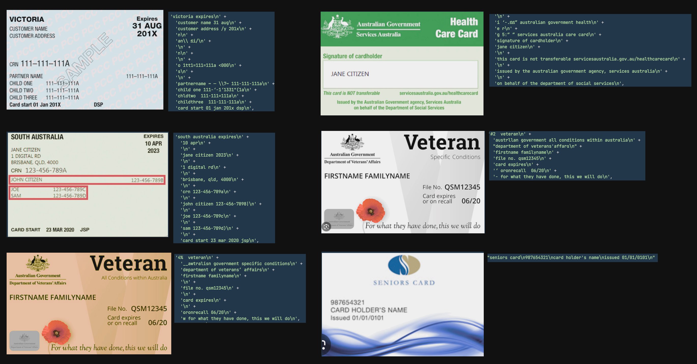

### Quick PoC for reading Australian concession cards using tesseract

##### Description

Currently this will just log the results of the images found in the images folder.
I have code to preprocess these images as well, turn them greyscale / downscale / add filters etc but ive left that out of this quick demo to keep it simple.

##### Usage

`yarn install`

`yarn start`

The ocr results for each card will be shown in the console

##### Example of the results

Time to process images using tesseract:

`Images Processed: 6 | Total time: 1.19 seconds | Average time per image: 0.20 seconds`

